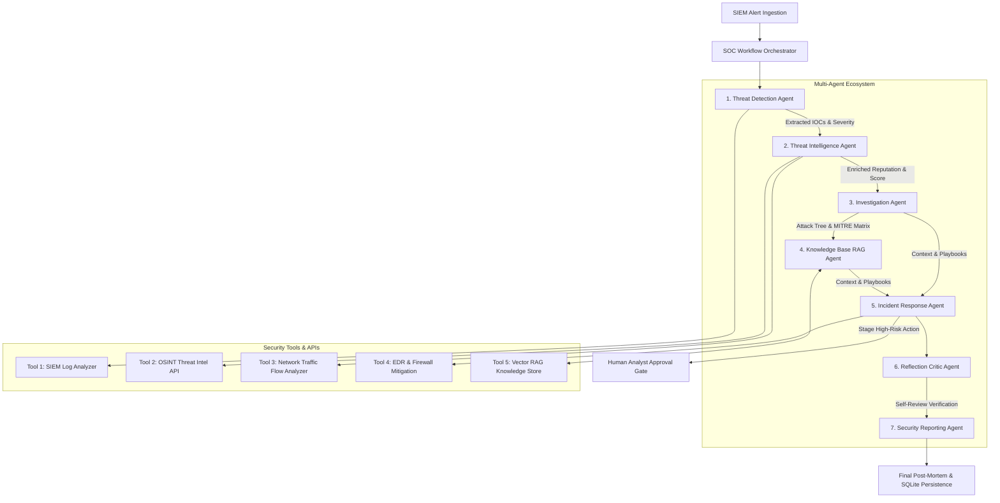

# 🛡️ Autonomous AI Security Operations Centre (AI SOC)
### OpenAI Capstone Project • Cyber Security Domain


---

## 📌 Overview
The **Autonomous AI Security Operations Centre (AI SOC)** is a portfolio-grade, multi-agent cybersecurity platform designed to investigate security alerts, correlate OSINT threat intelligence, retrieve NIST playbooks via vector RAG, enforce Human-in-the-Loop containment safeguards, and generate executive post-mortem reports.

### 🌟 Key Highlights
- **6 Specialized AI Agents**: Threat Detection, Threat Intelligence, Investigation, Knowledge Base RAG, Incident Response, and Security Reporting.
- **1 Reflection & Self-Review Critic Agent**: Double-checks evidence quality and false-positive risk.
- **5 Integrated Security Tools**: SIEM Parser, Threat Intel Connector (VirusTotal/AbuseIPDB/CISA KEV), Network Flow Analyzer, EDR & Firewall Mitigation Tool, and Vector RAG Knowledge Store.
- **Human-in-the-Loop (HITL) Gate**: Mandatory analyst approval portal for high-impact response actions (Host Isolation, Firewall IP Blocking).
- **SQLite Session Persistence**: Maintains persistent incident state and audit logs across sessions.
- **Cyberpunk Web UI Dashboard**: High-tech HTML5/CSS3 interface featuring live handoff node visualizers, MITRE ATT&CK heatmaps, and downloadable Markdown reports.

---

## 🏗️ System Architecture



---

## 📁 Repository Structure

```
OpenAI Capstone/
├── app.py                      # FastAPI Web Server & API Router
├── config.py                   # Global System Configuration & Prompts
├── database.py                 # SQLite Persistence & Audit Logging
├── test_system.py              # Automated Verification Test Suite
├── agents/                     # Specialized AI Agents
│   ├── threat_detection.py     # 1. Threat Detection Agent
│   ├── threat_intel.py         # 2. Threat Intelligence Agent
│   ├── investigation.py        # 3. Investigation Agent
│   ├── knowledge_base.py       # 4. Knowledge Base RAG Agent
│   ├── incident_response.py    # 5. Incident Response Agent
│   └── security_reporting.py   # 6. Security Reporting Agent
├── tools/                      # Integrated Security Tools
│   ├── siem_parser.py          # Tool 1: SIEM Log Triage
│   ├── threat_intel_tool.py    # Tool 2: OSINT Reputation (VT/AbuseIPDB)
│   ├── network_analyzer.py     # Tool 3: Network Traffic PCAP Flow
│   ├── edr_firewall_tool.py    # Tool 4: EDR Containment & Firewall Rule
│   └── rag_store.py            # Tool 5: Vector RAG Knowledge Base
├── orchestrator/               # Async Orchestration Engine
│   ├── workflow.py             # Multi-Agent Workflow Coordinator
│   └── reflection.py           # Reflection & Self-Review Critic Agent
├── static/                     # Web Application Frontend
│   ├── index.html              # Cyber SOC Dark-Mode Dashboard
│   ├── styles.css              # Cyberpunk CSS Theme System
│   ├── app.js                  # Frontend Application Logic & SSE
│   └── sample_alerts.json      # Realistic Cyber Security Alerts Dataset
└── docs/                       # Academic Capstone Deliverables
    ├── PROBLEM_ANALYSIS.md     # Deliverable 1: Business Context & Metrics
    ├── AGENT_ARCHITECTURE.md   # Deliverable 2: Agent Roles & Tool Matrix
    ├── DEMO_SCRIPT.md          # Deliverable 5A: 5-10 Min Demo Script
    └── PRESENTATION_SLIDES.md  # Deliverable 5B: 12-Slide Presentation Deck
```

---

## 🚀 Quickstart Guide

### 1. Prerequisites
- Python 3.10+ (Tested on Python 3.14)
- Installed dependencies: `openai`, `fastapi`, `uvicorn`, `pydantic`

### 2. Installation
Clone the repository and install requirements:
```bash
git clone https://github.com/your-username/openai-capstone-ai-soc.git
cd openai-capstone-ai-soc
pip install openai fastapi uvicorn pydantic
```

### 3. Launching the AI SOC Application
Run the FastAPI web application server:
```bash
python app.py
```
Open your browser and navigate to:  
👉 **`http://127.0.0.1:8000`**

### 4. Optional: OpenAI API Key Setup
The platform includes a **Deterministic Cyber Reasoning Engine** fallback so it runs fully operational out-of-the-box. To enable live OpenAI LLM calls, set your API key environment variable:
```bash
# Windows PowerShell
$env:OPENAI_API_KEY="your-actual-api-key"
```

---

## 🧪 Automated System Testing
Run the automated test suite to verify agent handoffs, tool execution, and SQLite database persistence:
```bash
python test_system.py
```

---

## 📚 Capstone Academic Deliverables Checklist

- [x] **1. Problem Analysis:** [`docs/PROBLEM_ANALYSIS.md`](file:///c:/Users/sajag/OneDrive/Desktop/OpenAI%20Capstone/docs/PROBLEM_ANALYSIS.md)
- [x] **2. Multi-Agent Design:** [`docs/AGENT_ARCHITECTURE.md`](file:///c:/Users/sajag/OneDrive/Desktop/OpenAI%20Capstone/docs/AGENT_ARCHITECTURE.md)
- [x] **3. Code Implementation:** 6 Specialized Agents, 5 Security Tools, HITL Gateway, RAG Store, SQLite Persistence.
- [x] **4. Advanced Features:** RAG Retrieval, Reflection Critic Agent, Async Parallel Execution, Session Persistence.
- [x] **5. Project Documentation:**
  - Demo Video Script: [`docs/DEMO_SCRIPT.md`](file:///c:/Users/sajag/OneDrive/Desktop/OpenAI%20Capstone/docs/DEMO_SCRIPT.md)
  - Presentation Slides Outline (12 Slides): [`docs/PRESENTATION_SLIDES.md`](file:///c:/Users/sajag/OneDrive/Desktop/OpenAI%20Capstone/docs/PRESENTATION_SLIDES.md)
  - Full README Documentation.

---

## 📄 License
MIT License. Built for the OpenAI Capstone Project.
